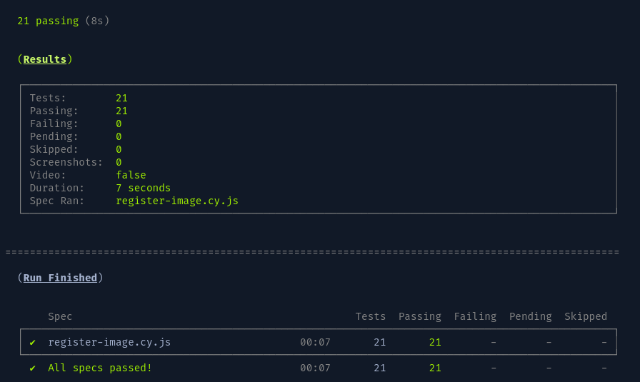

# Testes E2E Com cypress

## 🔥 Introdução

Aplicação de testes e2e com cypress na aplicação de exemplo [Vanilla JS Web App](https://erickwendel.github.io/vanilla-js-web-app-example/), foram realizados 3 cenários de testes:

- Enviando uma imagem com entradas inválidas
- Enviando uma imagem com entradas válidas usando a tecla enter
- Atualizando a página após enviar uma imagem clicando no botão de enviar

Todos os testes foram automatizados com o github actions.

### 🔨 Guia de instalação

Etapas para instalar:

Passo 1:

```
git clone https://github.com/Darlan0307/E2E-Cypress.git
```

Passo 2:

```
cd <nome_pasta_projeto>
```

Passo 3:

```
npm install
```

## 🛠️ Executando os testes

```

npm run cypress:headless
ou
npm run cypress:open

```

## 📦 Tecnologias usadas:

- 
- 
